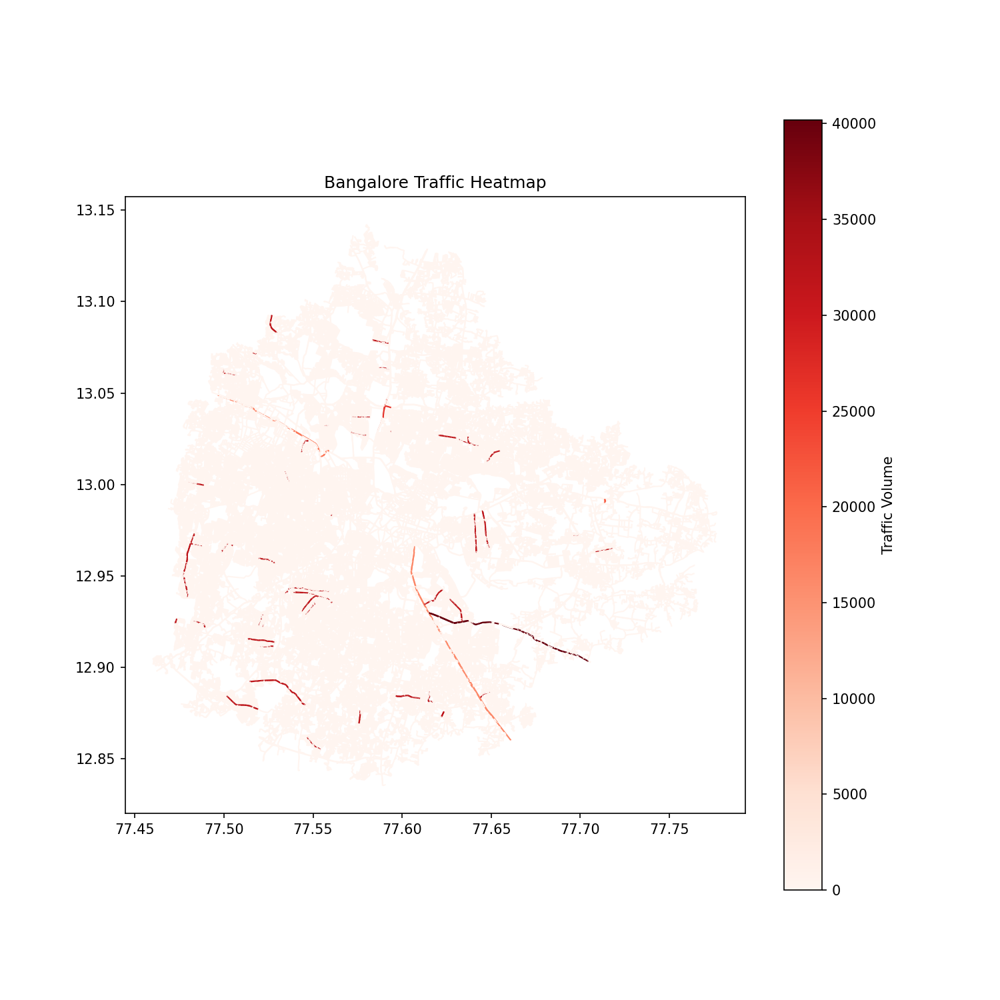
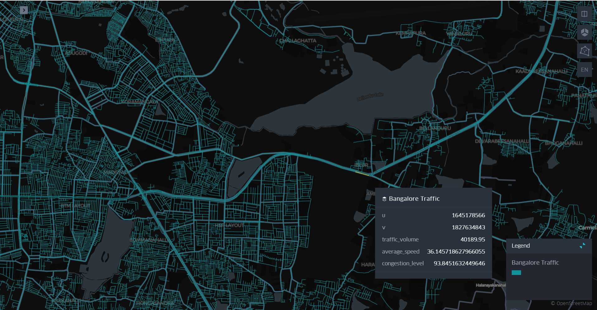

# Bangalore Traffic Graph

This repository hosts an interactive visualization and analysis toolkit for Bangalore’s traffic network.

It maps intersections and roads as a graph with congestion, speed, and volume metrics.
Nodes are sized by betweenness centrality to highlight critical bottlenecks.
The package also exports interactive Folium maps, static heatmaps, and GNN-ready edge lists.

## Features
- Load and normalize traffic dataset (CSV)
- Build Bangalore street graph from OpenStreetMap
- Map traffic volume → compute centralities
- Export interactive maps (Folium and Kepler.gl) and CSV edge lists
- Adaptive multi-layer maps: time-of-day or weekday/weekend automatically

## Traffic feature
This heatmap of Bangalore highlights traffic density across the city. Darker red lines mark high-congestion routes, while lighter shades indicate smoother flow. It provides a clear view of pressure points where better traffic management and infrastructure planning are needed



## Notorious Sarjapura Signal

Sarjapura Signal stands out as one of Bangalore’s busiest choke points. Traffic volume here touches 40,190 vehicles, with speeds averaging only 36 km/h. Congestion levels soar to nearly 94%, leaving little breathing room for the intersection to cope during peak hours. This hotspot doesn’t just slow local commuters; it creates ripple effects across surrounding corridors. The data makes it clear—without smarter traffic management and infrastructure upgrades, Sarjapura Signal will remain a major bottleneck in the city’s road network.


## Quick start
```bash
git clone https://github.com/vivek2589/bangalore_graph_package.git
cd bangalore_graph_package
pip install -r requirements.txt
python example_usage.py
# or install editable and use CLI:
pip install -e .
bangalore-traffic run --csv Banglore_traffic_Dataset.csv --output-dir outputs
```

## Outputs
- `bangalore_basic_map.html` — Single-layer Folium map
- `bangalore_time_filtered_map.html` — Multi-layer Folium map (time/day filters)
- `bangalore_traffic_kepler.html` — Kepler.gl map (lightweight)
- `bangalore_heatmap.png` — Static Matplotlib heatmap
- `bangalore_graph_edges.csv` — Edge list for ML/GNN

## License
MIT
